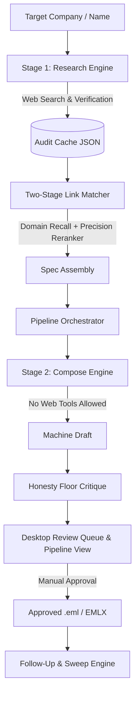

# Outreach Wizz-ard Architecture & System Design

This document details the software architecture, design trade-offs, and security boundaries of Outreach Wizz-ard.

---

## 1. System Overview

Outreach Wizz-ard is a desktop application designed for fact-grounded candidate outreach. It operates via a strict **two-stage architecture** that separates web research from email composition.



---

## 2. The Two-Stage Pipeline Architecture

### Stage 1: Fact Research (`app/research.py`)
- **Responsibility:** Web search, domain resolution, identity anchor disambiguation, contact pattern resolution, and fact extraction.
- **Contract:** Produces a schema-validated, immutable JSON research cache file (`cache_<slug>.json`).
- **Security Scoping:** All external HTTP calls and web search interactions occur strictly within Stage 1. Once a research cache is written, no subsequent step invokes external web search tools.

### Stage 2: Fact-Grounded Composition (`app/compose.py`, `app/pipeline.py`)
- **Responsibility:** Executed by `app/pipeline.py` to assemble target specs, select relevant candidate experience anchors, invoke the LLM compose prompt, and run static honesty critiques.
- **Strict Fact Isolation:** The compose prompt is handed only the facts extracted into the research cache and the user's candidate profile. It is forbidden from fetching external data or generating unsourced numerical claims.

---

## 3. Dynamic Voice System & Two-Stage Link Matcher

### Voice Data Model (`app/models.py`, `app/seed_voices/`)
- Voices are fully editable JSON documents (`CustomVoice`) stored in the user data directory.
- Each voice configures greeting, optional opening (with raise-swap opener templates), body guidance, and closing blocks, alongside formality, warmth, directness, and proof density sliders.

### Two-Stage Candidate Link Resolution (`app/link_matcher.py`)
1. **Stage 1 (Recall):** Free, deterministic domain matcher (`engine.draft_engine.target_domains`) scores and narrows candidate experiences to a top 3 shortlist based on company what-they-do and situation read.
2. **Stage 2 (Precision):** A single LLM reranker evaluates the shortlist against the company's specific situation.
3. **Invariants & Safeguards:**
   - **Recall Cap:** The precision reranker can reorder or downgrade candidate links, but can never promote a link above what Stage 1 recall discovered.
   - **Confidence Floor:** Requires `MIN_CONFIDENCE = 0.55`; lower confidence claims degrade to `weak`.
   - **Graceful Fallback:** Provider errors or stub runs fall back to deterministic keyword matches rather than failing or inventing links.

---

## 4. Triage & Pipeline State Machine (`app/store.py`, `app/pipeline_view.py`, `app/outcomes.py`)

Every target progresses through a deterministic lifecycle state machine:

```
[ queued ] ──> [ drafted ] ──> [ approved ] ──> [ sent ] ──> [ replied | bounced | no_response ]
```

- **Read-First Pipeline Projection (`app/pipeline_view.py`):** Derives a 6-column Kanban board (`Researching`, `Drafted`, `Sent`, `Replied`, `Bounced`, `No response`) directly from existing state (`State` + `reply_state` + `pipeline_flag`), avoiding duplicate state machines.
- **Outbox Isolation:** Approved drafts are saved as `.eml` files into `outbox/` for sending via the local mail client. Internal metadata files remain isolated in `outbox_helper/`.

---

## 5. Security & Safety Model

1. **Host Header Allowlist:** The embedded FastAPI server enforces a strict host allowlist rejecting non-loopback IPv4/IPv6 headers.
2. **Keyring Integration:** Provider API keys are stored securely using the OS native keyring service (`keyring` library), avoiding plaintext key storage in config files.
3. **Sanitised Mail File Generation:** `.eml` exports strip script tags and remote tracking pixels, ensuring safety when opened in native email clients.
4. **Advisory Honesty Floor:** Static checks in `engine/draft_engine.py` audit numeric claims, em-dashes, and forbidden phrases without silently modifying user intent.

---

## 6. Sourcing & Enrichment (`app/apollo.py`, `app/ingest.py`, `app/tracker.py`)

- **Bulk Apollo Enrichment (`app/apollo.py`):** Verifies contact email addresses in bulk via the Apollo API (`/api/apollo/verify`). Requires `reveal_personal_emails` passed strictly as a query parameter (not in the request body). Stages drafts as `.eml` files with `X-Unsent: 1` headers opened in compose mode via OS default handlers (`os.startfile` on Windows, `open` on macOS, `xdg-open` on Linux).
- **Ingestion Normalization (`app/ingest.py`):** Normalizes pasted target lists, CSV uploads, and Excel workbooks into a single internal target shape.
- **Tracker Integration (`app/tracker.py`):** Two-way synchronization with Excel `Outreach_Tracker.xlsx` workbooks. Reads target lists on ingest and writes sent rows back defensibly to the `Reach Out To` worksheet.

---

## 7. Self-Learning Voice System (`app/voice_learning.py`, `app/voice_optimize.py`, `app/voice_stats.py`, `app/edit_ledger.py`)

The self-learning voice framework implements a 4-layer preference learning architecture:

1. **Evidence Layer (`app/voice_stats.py`):** Computes Wilson score confidence intervals for reply and bounce rates per voice. Bounces are excluded from the reply-rate denominator (bounces represent dead addresses, not non-replies). Bare percentages are hidden below minimum sample size thresholds.
2. **Adaptive Few-Shot Layer (`app/edit_ledger.py`):** Captures raw before/after edit pairs at approve time as `(draft, approved)` JSONL records under `S.VOICE_EDITS_DIR`, calculating edit-distance effort scores and injecting rolling windows into compose prompts.
3. **Continuous Learning Loop (`app/voice_learning.py`):** Executes a `gather -> reflect -> clamp -> apply` cycle requiring at least 2 independent edits to trigger. Proposes bounded voice patches (style-slider deltas, notes, examples), clamping proposals through the honesty floor. Operates in 3 modes (`off`, `suggest`, `auto`). Modeled on PRELUDE/CIPHER interpretable preference learning.
4. **Batch Optimization (`app/voice_optimize.py`):** A GEPA-style batch optimizer running over a voice's entire accumulated edit corpus. Evaluates candidate patches against a held-out split of past edits via phrasing overlap metrics, promoting the winner as an A/B `challenger` voice rather than overwriting blind.

---

## 8. Automated Follow-Up & Compliance (`app/followups.py`, `app/sweep.py`, `app/detect.py`, `app/inbox.py`, `app/suppression.py`)

- **Event-Driven Follow-Up Cadences (`app/followups.py`):** Approving an initial outreach email auto-enrolls the target in a follow-up sequence. Chains `due_at` timestamps from the original approval time using configurable per-step delay cadences (default `3-7-7`), capped.
- **Inbox Sweep & Escalation (`app/sweep.py`, `app/detect.py`):** `detect.py` performs pure RFC822 classification (In-Reply-To/References header matching, DSN detection). On reply, pauses follow-up cadence. On bounce, auto-suppresses dead addresses in `app/suppression.py` and stages a re-draft to the next contact rung (escalates to a different contact person at the target).
- **Read-Only IMAP Access (`app/inbox.py`):** Implements read-only IMAP polling using `imap-tools` or stdlib `imaplib`. Enforces a strict structural invariant wrapped by a guard: structurally incapable of mailbox mutation (no `APPEND`, `STORE`, `flag`, `MOVE`, `COPY`, `EXPUNGE`, or `DELETE`).
- **Suppression & Dedup (`app/suppression.py`):** Maintains a persistent do-not-contact list and archive-aware dedup to prevent re-queuing contacted or bounced addresses.

---

## 9. Cost Accounting (`app/cost.py`)

- **Real-Time Cost Meter (`app/cost.py`):** Accumulates session-level and per-draft token usage and dollar costs against a per-model price table in settings. Updates the in-app header cost meter in real time.
