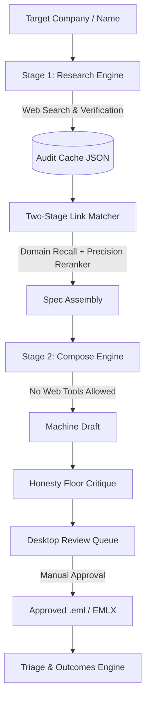

# Outreach Wizz-ard Architecture & System Design

This document details the software architecture, design trade-offs, and security boundaries of Outreach Wizz-ard.

---

## 1. System Overview

Outreach Wizz-ard is a desktop application designed for fact-grounded candidate outreach. It operates via a strict **two-stage architecture** that separates web research from email composition.



---

## 2. The Two-Stage Pipeline Architecture

### Stage 1: Fact Research (`app/research.py`)
- **Responsibility:** Web search, domain resolution, identity anchor disambiguation, contact pattern resolution, and fact extraction.
- **Contract:** Produces a schema-validated, immutable JSON research cache file (`cache_<slug>.json`).
- **Security Scoping:** All external HTTP calls and web search interactions occur strictly within Stage 1. Once a research cache is written, no subsequent step invokes external web search tools.

### Stage 2: Fact-Grounded Composition (`app/compose.py`, `engine/draft_engine.py`)
- **Responsibility:** Assembles target specs, selects relevant candidate experience anchors, invokes the LLM compose prompt, and runs static honesty critiques.
- **Strict Fact Isolation:** The compose prompt is handed only the facts extracted into the research cache and the user's candidate profile. It is forbidden from fetching external data or generating unsourced numerical claims.

---

## 3. Dynamic Voice System & Two-Stage Link Matcher

### Voice Data Model (`app/models.py`, `app/seed_voices/`)
- Voices are fully editable JSON documents (`CustomVoice`) stored in the user data directory.
- Each voice configures greeting, optional opening (with raise-swap opener templates), body guidance, and closing blocks, alongside formality, warmth, directness, and proof density sliders.

### Two-Stage Candidate Link Resolution (`app/link_matcher.py`)
1. **Stage 1 (Recall):** Free, deterministic domain matcher (`engine.draft_engine.target_domains`) scores and narrows candidate experiences to a top 3 shortlist based on company what-they-do and situation read.
2. **Stage 2 (Precision):** A single LLM reranker evaluates the shortlist against the company's specific situation.
3. **Invariants & Safeguards:**
   - **Recall Cap:** The precision reranker can reorder or downgrade candidate links, but can never promote a link above what Stage 1 recall discovered.
   - **Confidence Floor:** Requires `MIN_CONFIDENCE = 0.55`; lower confidence claims degrade to `weak`.
   - **Graceful Fallback:** Provider errors or stub runs fall back to deterministic keyword matches rather than failing or inventing links.

---

## 4. Triage & Outcomes State Machine (`app/store.py`, `app/outcomes.py`)

Every target progresses through a deterministic lifecycle state machine:

```
[ queued ] ──> [ drafted ] ──> [ approved ] ──> [ sent ] ──> [ replied | bounced | no_response ]
```

- **Outbox Isolation:** Approved drafts are saved as `.eml` files into `outbox/` for sending via the local mail client. Internal metadata files remain isolated in `outbox_helper/`.
- **Bounce Escalation:** If a message bounces due to an invalid contact pattern, the system updates the target state, logs the bounce outcome, and recommends secondary pattern fallbacks (`{first}@domain`).

---

## 5. Security & Safety Model

1. **Host Header Allowlist:** The embedded FastAPI server enforces a strict host allowlist rejecting non-loopback IPv4/IPv6 headers.
2. **Keyring Integration:** Provider API keys are stored securely using the OS native keyring service (`keyring` library), avoiding plaintext key storage in config files.
3. **Sanitised Mail File Generation:** `.eml` exports strip script tags and remote tracking pixels, ensuring safety when opened in native email clients.
4. **Advisory Honesty Floor:** Static checks in `engine/draft_engine.py` audit numeric claims, em-dashes, and forbidden phrases without silently modifying user intent.
