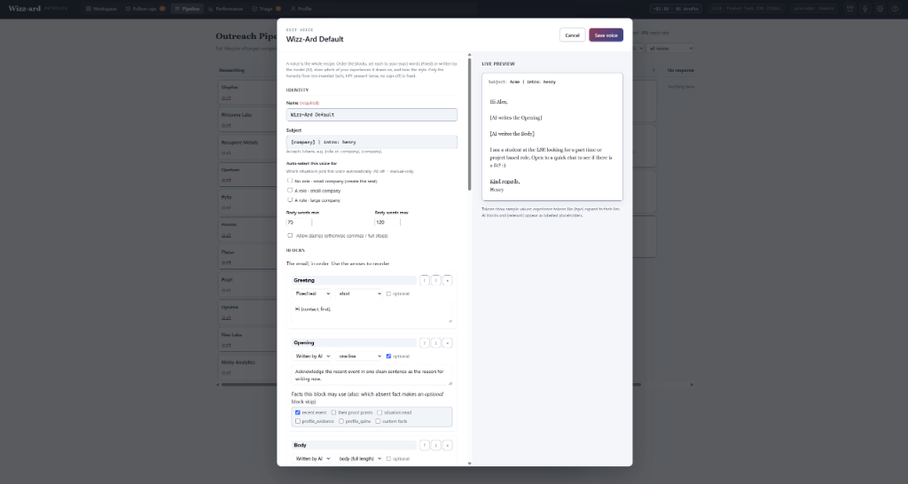
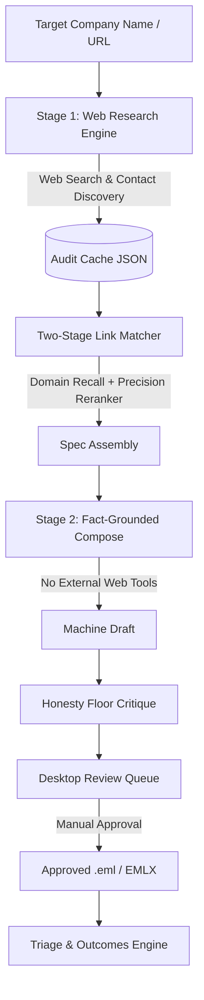

# Outreach-Wizzz-Ard

[](https://github.com/henryhorton19-web/Outreach-Wizzz-Ard/actions/workflows/ci.yml)
[](LICENSE)
[](https://www.python.org/)

Outreach Wizz-ard is an end-to-end outbound outreach system: it sources targets and verified contacts, researches and drafts fact-grounded emails, runs automated CRM-style follow-up sequences, tracks outcomes, and continuously tunes its own voice from your edits — without ever sending anything you haven't approved.

## Why

Cold outreach at any volume forces a choice between templates that read as templates and
hand-writing every email. This engine takes the third option: it researches each target,
grounds every claim in a fact it can point to, drafts in a voice you have tuned, and stops
at a review gate before anything is sent. It was built to solve one concrete problem — finding
a part-time seat during an exchange year in Paris — and the engine, voice system and pipeline
are domain-agnostic. Only `engine/config.py`'s `CANDIDATE_PROFILE` and the voices themselves
are specific to a given deployment.

---

## Capabilities

- **Sourcing & enrichment** — paste targets, a CSV, or a tracker workbook (`app/ingest.py`, `app/tracker.py`); contacts are verified in bulk via Apollo (`app/apollo.py`) before a draft is ever staged.
- **Fact-grounded drafting** — research (`app/research.py`) and composition (`app/compose.py`) run as separate stages so the model writing the email never has live web access (see How It Works).
- **Self-learning voices** — every approved edit is captured (`app/edit_ledger.py`) and fed back into a bounded, auditable learning loop (`app/voice_learning.py`, `app/voice_optimize.py`) that proposes voice-style patches, A/B-tests them, and promotes only what measurably matches your own editing history. See [`docs/design/VOICE_LEARNING_PLAN.md`](docs/design/VOICE_LEARNING_PLAN.md).
- **Automated follow-up** — approving a draft enrolls a CRM-style follow-up cadence (`app/followups.py`); bounces auto-suppress the dead address and escalate to a different contact at the same target (`app/sweep.py`, `app/detect.py`).
- **Outcomes & pipeline tracking** — a 6-column Kanban view (`app/pipeline_view.py`) and per-voice reply/bounce statistics with Wilson confidence intervals (`app/voice_stats.py`) built entirely from existing state.
- **Cost accounting** — live per-session and per-draft token cost (`app/cost.py`), shown in-app.
- **Compliance** — a persistent do-not-contact list (`app/suppression.py`) and archive-aware dedup prevent double-contacting or re-queuing bounced addresses.

---

## Screenshots


*A 6-column Kanban view derived entirely from existing state (`app/pipeline_view.py`) — no separate state machine.*


*The interactive voice editor — configure greetings, AI openers, body guidance, and live token previews.*

---

## How It Works

The system operates as a deterministic, two-stage pipeline:



1. **Stage 1 — Web Research (`app/research.py`):** Fetches target company information, resolves official domain names, extracts stated plans and proof points, and identifies contact details via verified pattern lookup. Stores output as a schema-validated audit cache (`cache_<slug>.json`).
2. **Two-Stage Link Matcher (`app/link_matcher.py`):** Combines a free domain recall matcher (`engine.draft_engine.target_domains`) with a single LLM precision reranker to evaluate whether a genuine connection exists between the candidate's background and the target company.
3. **Stage 2 — Fact-Grounded Composition (`app/compose.py`, `app/pipeline.py`):** Generates draft emails using only the extracted JSON cache and the user's candidate profile. Web tools are disabled during composition to prevent hallucination.
4. **Honesty Floor Critique (`engine/draft_engine.py`):** Audits completed drafts against numeric accuracy, em-dashes, forbidden hype phrases, and presumptuous openers. Critiques are advisory: no draft is silently discarded, keeping final editorial control with the human operator.
5. **Review Queue & Triage (`ui/`, `app/outcomes.py`, `app/pipeline_view.py`):** Presents drafts in a desktop interface for human review, manual edits, approval, and lifecycle outcome tracking (sent, replied, bounced, no-response).

---

## Subsystems

### Self-Learning Voices

Every approved edit is captured as a before/after pair in `app/edit_ledger.py`. The system builds a 4-layer preference loop (`voice_stats.py` -> `edit_ledger.py` -> `voice_learning.py` -> `voice_optimize.py`). It operates in three configurable modes (`off`, `suggest`, `auto`), applying bounded style-slider and guidance patches clamped through the honesty floor. Batch optimization runs held-out scoring against past edits and promotes winning patches as A/B challenger voices rather than overwriting blind. For full details, see [`docs/design/VOICE_LEARNING_PLAN.md`](docs/design/VOICE_LEARNING_PLAN.md) and [`docs/design/VOICE_LEARNING_BUILD.md`](docs/design/VOICE_LEARNING_BUILD.md).

### Sourcing & Follow-Up Automation

Targets ingested from text, CSV, or `Outreach_Tracker.xlsx` (`app/ingest.py`, `app/tracker.py`) undergo bulk Apollo contact verification (`app/apollo.py`) before staging. Approving an initial outreach draft auto-enrolls a CRM-style follow-up sequence on a configurable delay cadence (`app/followups.py`). The automated inbox sweep (`app/sweep.py`, `app/inbox.py`, `app/detect.py`) pauses follow-up cadences on reply and auto-suppresses dead addresses on bounce (`app/suppression.py`), staging a re-draft to the next contact rung. For full details, see [`docs/design/FOLLOWUP_ARCHITECTURE.md`](docs/design/FOLLOWUP_ARCHITECTURE.md) and [`docs/design/MANUAL_OUTCOMES_BUILD.md`](docs/design/MANUAL_OUTCOMES_BUILD.md).

---

## Quick Start & Fresh Setup Guide

Follow these steps for a complete, fresh setup ("virgin run") of Outreach Wizz-ard on a new local machine:

### 1. Prerequisites
- **Python**: Version 3.11, 3.12, or 3.13 (Python 3.14+ is unsupported).
- **Git**: Installed and available on system `PATH`.

### 2. Clone & Setup Virtual Environment

**Windows (PowerShell):**
```powershell
git clone git@github.com:henryhorton19-web/Outreach-Wizzz-Ard.git outreach-wizzard
cd outreach-wizzard
python -m venv venv
.\venv\Scripts\Activate.ps1
python -m pip install --upgrade pip
pip install -r requirements.txt
```

**macOS / Linux (Bash):**
```bash
git clone git@github.com:henryhorton19-web/Outreach-Wizzz-Ard.git outreach-wizzard
cd outreach-wizzard
python3 -m venv venv
source venv/bin/activate
pip install --upgrade pip
pip install -r requirements.txt
```

### 3. Launching the Desktop Application

Outreach Wizz-ard includes OS-agnostic launcher scripts that automatically sync code, bootstrap seed data/voices, and launch the PyWebView desktop app:

**Windows (PowerShell):**
```powershell
cd "<path-to-repository>"
.\run-wizzard.ps1
```

**macOS / Linux (Bash):**
```bash
cd "<path-to-repository>"
./run-wizzard.sh
```

### 4. Running Verification Tests
```bash
python -m pytest tests/ -q
```

---

## Security & Reliability Model

- **Host Allowlist Security:** Embedded server rejects non-loopback HTTP host headers to protect local sessions.
- **Keyring Key Storage:** LLM API keys are stored securely using native OS keyring services rather than plaintext configuration files.
- **Safe Outbox Exports:** Approved drafts export as clean `.eml` files stripped of executable scripts or remote tracking pixels.
- **Job Persistence & Checkpointing:** Long-running batch draft operations feature per-company checkpointing and 3-attempt exponential backoff retry logic.

---

## Further Reading

- [ARCHITECTURE.md](ARCHITECTURE.md) — Comprehensive technical system design, pipeline mechanics, state machines, and security architecture.
- [docs/design/VOICE_LEARNING_PLAN.md](docs/design/VOICE_LEARNING_PLAN.md) — System design for continuous preference learning and GEPA-style voice optimization.
- [docs/design/FOLLOWUP_ARCHITECTURE.md](docs/design/FOLLOWUP_ARCHITECTURE.md) — Architecture spec for automated follow-up cadences and bounce escalation.
- [docs/design/MANUAL_OUTCOMES_BUILD.md](docs/design/MANUAL_OUTCOMES_BUILD.md) — Design spec for Triage outcomes, suppression lists, and email status state machines.
- [docs/design/FIRST_TIME_SETUP.md](docs/design/FIRST_TIME_SETUP.md) — Initial environment configuration and provider API key setup.
- [docs/design/SCHEMA.md](docs/design/SCHEMA.md) — Reference schemas for research caches, custom voices, and candidate profiles.
- [docs/design/SYNC_SETUP.md](docs/design/SYNC_SETUP.md) — Two-repo synchronization architecture (public code vs. private data repository).
- [docs/README.md](docs/README.md) — Directory index for design documentation and historical build logs.

## Integrations

| Service | Used for |
|---|---|
| Anthropic API | research synthesis and drafting |
| Google GenAI | alternate drafting provider |
| tech.eu funding feed | sourcing signal for recently funded companies |
| IMAP (read-only) | reply and bounce detection |
| OS keyring | credential storage, never a file |

## What is not in this repo

The personal profile, the tuned outreach voices, the contact lists, the staged email bodies
and the contacted-exclusion set are all git-ignored local state. Fixtures and seed voices ship
as clearly fictional examples using reserved `.test` domains (RFC 2606). No credentials of any
kind are committed.

## Licence

MIT — see [LICENSE](LICENSE).
