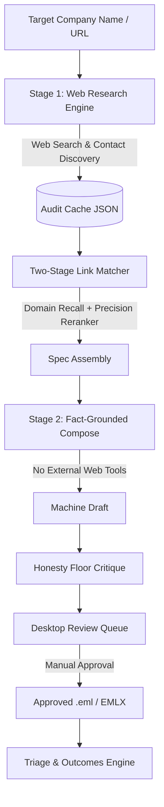

# Outreach Wizz-ard

[](https://www.python.org/)
[](LICENSE)
[](tests/)

A fact-grounded desktop email drafting application built to research targets, resolve contacts, and compose personalized candidate outreach for operating seats during the Sciences Po Paris exchange year.

---

## Why This Exists

Outreach Wizz-ard originated as a domain re-aim of an Example Capital deal-sourcing outreach engine, repointed at a personal candidate job search problem. Rather than using unconstrained LLM text generation, the application enforces a strict separation between web fact-gathering and email composition. Every statement, metric, and company fact in a generated draft is traceable back to audited research JSON caches or a verified candidate profile.

> **Provenance is the product.** The engine enforces a strict honesty floor: no invented numbers, no unsourced claims, and no hallucinated background links.

---

## How It Works

The system operates as a deterministic, two-stage pipeline:



1. **Stage 1 — Web Research (`app/research.py`):** Fetches target company information, resolves official domain names, extracts stated plans and proof points, and identifies contact details via verified pattern lookup. Stores output as a schema-validated audit cache (`cache_<slug>.json`).
2. **Two-Stage Link Matcher (`app/link_matcher.py`):** Combines a free domain recall matcher (`engine.draft_engine.target_domains`) with a single LLM precision reranker to evaluate whether a genuine connection exists between the candidate's background and the target company.
3. **Stage 2 — Fact-Grounded Composition (`app/compose.py`):** Generates draft emails using only the extracted JSON cache and the user's candidate profile. Web tools are disabled during composition to prevent hallucination.
4. **Honesty Floor Critique (`engine/draft_engine.py`):** Audits completed drafts against numeric accuracy, em-dashes, forbidden hype phrases, and presumptuous openers. Critiques are advisory: no draft is silently discarded, keeping final editorial control with the human operator.
5. **Review Queue & Triage (`ui/`, `app/outcomes.py`):** Presents drafts in a desktop interface for human review, manual edits, approval, and lifecycle outcome tracking (sent, replied, bounced, no-response).

<!-- TODO(Henry): add 3 real screenshots — review queue, voice editor, Triage view -->

---

## Quick Start

### Running the Desktop App

Outreach Wizz-ard includes OS-agnostic launcher scripts that automatically handle environment activation and launch the desktop GUI:

**Windows (PowerShell):**
```powershell
cd "<path-to-paris-outreach>"
.\run-wizzard.ps1
```

**macOS / Linux (Bash):**
```bash
cd "/path/to/paris-outreach"
./run-wizzard.sh
```

### Local Development & Testing

1. **Install Dependencies:**
   ```bash
   python -m venv venv
   source venv/bin/activate  # On Windows: .\venv\Scripts\Activate.ps1
   pip install -r requirements.txt
   ```

2. **Run Test Suite & Quality Gates:**
   ```bash
   python -m pytest -q
   python tools/check_style_purity.py
   ```

---

## Security & Reliability Model

- **Host Allowlist Security:** Embedded server rejects non-loopback HTTP host headers to protect local sessions.
- **Keyring Key Storage:** LLM API keys are stored securely using native OS keyring services rather than plaintext configuration files.
- **Safe Outbox Exports:** Approved drafts export as clean `.eml` files stripped of executable scripts or remote tracking pixels.
- **Job Persistence & Checkpointing:** Long-running batch draft operations feature per-company checkpointing and 3-attempt exponential backoff retry logic.

---

## Further Reading

- [ARCHITECTURE.md](ARCHITECTURE.md) — Comprehensive technical system design, pipeline mechanics, state machines, and security architecture.
- [docs/design/FIRST_TIME_SETUP.md](docs/design/FIRST_TIME_SETUP.md) — Initial environment configuration and provider API key setup.
- [docs/design/SCHEMA.md](docs/design/SCHEMA.md) — Reference schemas for research caches, custom voices, and candidate profiles.
- [docs/design/SYNC_SETUP.md](docs/design/SYNC_SETUP.md) — Two-repo synchronization architecture (public code vs. private data repository).
- [docs/README.md](docs/README.md) — Directory index for design documentation and historical build logs.
