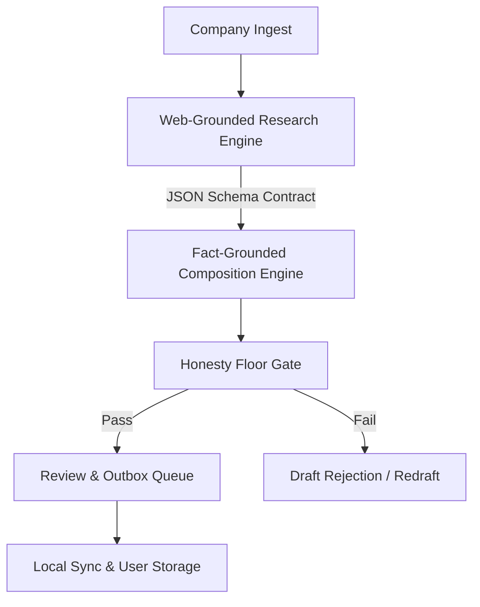

# Outreach Wizz-ard

A desktop application that researches a company, drafts a personalised outreach email grounded in sourced facts, and refuses to send anything it cannot evidence.


## What it does

* **Web-Grounded Research Pipeline:** Ingests company targets, verifies leadership contacts against company domains, and extracts structured milestone facts into a validated JSON schema cache.
* **Fact-Grounded Email Composition:** Generates tailored outreach drafts using customizable voice recipes, block-level guidance, and candidate-experience bridges.
* **Enforced Honesty Floor:** Static analysis rejects any draft containing unsourced numeric claims, fabricated customer names, or domain mismatches before reaching the user review queue.
* **Local-First Privacy Architecture:** Keeps sensitive client data, outbox queues, and private voice presets isolated in user data directories (`%APPDATA%\OutreachWizzard` or `~/.outreach_wizzard`).
* **Custom Quality Gates:** Enforces codebase integrity via 6 custom static analysis tools checking HTML markup, selector binding, CSS contrast, style encapsulation, domain vocabulary, and JS syntax.

## Architecture



## Key Technical Highlights

* **Two-Stage Schema Contract:** Web-grounded research produces a strict JSON contract (`engine/schema.json`), allowing instant, zero-cost email redrafts without repeating web searches.
* **Domain-Pinned Contact Discovery:** Eliminates contact hallucination by validating contact email addresses strictly against target corporate domains.
* **Hard Verification Floor:** Enforces strict provenance gates over model outputs, guaranteeing every statistic and claim traces back to verified source facts.
* **Thread Pool Async Offloading:** Prevents FastAPI event loop blocking by offloading synchronous workload handlers to worker thread pools.
* **Custom Quality Gates & 337 Passing Tests:** Maintains 6 custom static analysis gates in `tools/` and a comprehensive pytest test suite.

## Quickstart

```powershell
git clone https://github.com/henryhorton19-web/paris-outreach.git
cd paris-outreach
.\run-wizzard.ps1
```

*(For developer guidelines, see [`AGENTS.md`](file:///C:/Users/HenryHorton/OneDrive%20-%20HPE%20Growth%20Capital/Documents/HPE%20Growth%20Internship/09%20Personal%20Projects/paris-outreach/AGENTS.md). Detailed engineering post-mortems and decisions are documented in [`docs/ENGINEERING.md`](file:///C:/Users/HenryHorton/OneDrive%20-%20HPE%20Growth%20Capital/Documents/HPE%20Growth%20Internship/09%20Personal%20Projects/paris-outreach/docs/ENGINEERING.md).)*

## Tech Stack

Python 3.12 · FastAPI · pywebview · Vanilla JS · Gemini & Anthropic Providers
